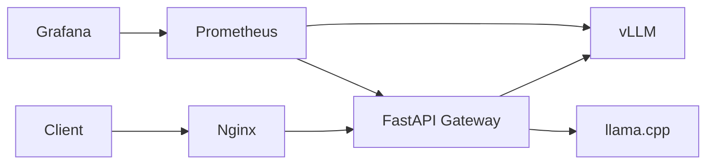
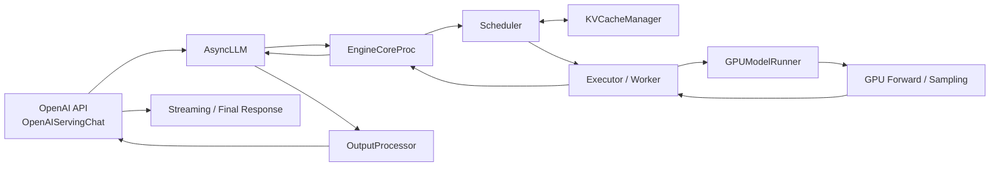

# LLM Serving Performance Lab

面向单机 GPU 的大模型推理服务与性能诊断项目。项目以 vLLM 为主要推理引擎，使用 FastAPI Gateway、Prometheus 和 Grafana 构建服务与观测链路，并通过 E1–E4 控制变量实验分析 Prefill、Scheduler、KV Cache 与 Decode 压力。

## 核心成果

- 使用 vLLM Native Metrics 对照 TTFT、Queue 与 Prefill 的变化，避免依赖单一端到端延迟判断瓶颈。
- 在相同 c32 workload 下将 `max_num_seqs` 从 32 降至 8，Queue 从约 1.08 s 增至 5.43 s，验证 Scheduler admission capacity 对首 token 延迟的影响。
- 将 `gpu_memory_utilization` 从 0.85 降至 0.35 后，TTFT 仍约为 1.67 s 且未发生 Preemption，说明当前 workload 的主导瓶颈不是 KV capacity。
- 在固定 129-token 输入和 512-token 输出的流式实验中，concurrency 1→32 时 TPOT P50 从 5.80 ms 增至 7.31 ms，同时请求窗口输出吞吐显著增长。
- 在 RTX 4090D 上完成 Qwen2.5-7B FP16 与 AWQ-Int4 的 95 组、2850 请求部署压测，并探索 GPTQ、AWQ 与 GGUF 格式在 vLLM/llama.cpp 中的部署边界。
- 阅读并整理 vLLM V1 Engine 的请求接入、Scheduler、KV Cache、GPU 执行与输出链路。

## 系统结构



Gateway 提供 OpenAI 风格的 `/v1/chat/completions` 接口、AUTO/固定后端模式、流式转发、请求级 trace ID、结构化日志和 Prometheus 指标。AUTO 模式中的 512-token 阈值用于展示路由机制，不代表生产环境的最优边界。

### vLLM 请求处理链路



该图概括 vLLM V1 的请求接入、调度、KV Cache 分配、GPU 执行和输出返回路径。源码阅读基于 vLLM 0.21.0；E1–E4 使用 0.22.1，未宣称逐函数完全一致。完整调用关系和关键源码入口见 [vLLM V1 系统架构与请求链路](docs/VLLM_SYSTEM_ARCHITECTURE.md)。

## 关键实验结果

### E2：Prompt Length 与 Prefill

固定 concurrency=4，Prompt 从 137 增至 2054 tokens：

| Prompt tokens | Prefill | Queue | Native TTFT |
|---:|---:|---:|---:|
| 137 | 48.4 ms | 0.02 ms | 64.7 ms |
| 515 | 159.9 ms | 0.02 ms | 180.8 ms |
| 1028 | 279.6 ms | 19.1 ms | 326.1 ms |
| 2054 | 482.2 ms | 104.8 ms | 672.4 ms |

短 Prompt 下 TTFT 增长主要来自 Prefill；Prompt 进一步变长后，Queue 也开始放大 TTFT。

### E3A：Scheduler Capacity

固定 prompt≈1028、max_tokens=256、concurrency=32：

| `max_num_seqs` | Prefill | Queue | Native TTFT |
|---:|---:|---:|---:|
| 32 | 472.9 ms | 1076.6 ms | 1666.0 ms |
| 8 | 271.6 ms | 5431.1 ms | 5808.6 ms |

TTFT 的新增部分主要累积在 Queue，而 Prefill 没有同步恶化。该结果支持 Queue-dominated TTFT 的判断。

### E3B：KV Capacity 排除实验

固定 prompt≈1028、max_tokens=256、concurrency=32、`max_num_seqs=32`：

| `gpu_memory_utilization` | Prefill | Queue | Native TTFT |
|---:|---:|---:|---:|
| 0.85 | 472.9 ms | 1076.6 ms | 1666.0 ms |
| 0.40 | 473.5 ms | 1106.0 ms | 1668.1 ms |
| 0.35 | 467.6 ms | 1089.9 ms | 1674.1 ms |

显著压缩 KV budget 后，TTFT 没有出现有意义的变化，且 `preemptions_delta=0`。这个 workload 下的主要限制仍来自调度与 admission pressure。

### E4：Decode 吞吐与延迟

固定 129-token 输入、512-token 输出、Streaming：

| Concurrency | Client TPOT P50 | Native TPOT | 请求窗口输出吞吐 |
|---:|---:|---:|---:|
| 1 | 5.80 ms | 5.80 ms | 170.8 tok/s |
| 4 | 5.83 ms | 5.85 ms | 669.7 tok/s |
| 8 | 5.99 ms | 6.02 ms | 1282.5 tok/s |
| 16 | 6.37 ms | 6.35 ms | 1989.0 tok/s |
| 32 | 7.31 ms | 7.19 ms | 2741.8 tok/s |

这是固定 40 请求批次的 request-window throughput，用于观察并发变化，不代表稳态最大吞吐或系统饱和点。


## 量化模型部署与评测

项目历史阶段覆盖 FP16、GPTQ-Int4、AWQ-Int4、GGUF Q4_K_M 与 Q8_0，重点是量化模型的转换/加载、引擎兼容性、显存约束和服务性能评测，不将其表述为量化算法或 CUDA Kernel 研发。

| 范围 | 引擎与环境 | 可公开结论 |
|---|---|---|
| FP16：72 组、2160 请求 | vLLM 0.22.1 / RTX 4090D | 与 AWQ 共享部分 workload，可比较非流式 E2E 和 request output rate |
| AWQ-Int4：23 组、690 请求 | vLLM 0.22.1 / RTX 4090D | 验证 INT4 权重加载、Marlin 执行路径与并发压测流程 |
| GPTQ / AWQ 小样本探索 | vLLM / RTX 4090D | 用于理解格式、显存预分配和部署差异，不作为主性能结论 |
| GGUF Q4_K_M / Q8_0 | llama.cpp / RTX 5060 | 用于本地 8 GB 显存部署验证，不与 4090D 速度直接比较 |

FP16 与 AWQ 矩阵共 95 组、2850 个成功请求。历史客户端是非流式实现，不能测量真实 TTFT/TPOT，因此旧报告中的同名字段不迁移；E1–E4 的 TTFT/TPOT 仍只采用 Native Metrics 或 Streaming Client。范围、证据和修正说明见 [量化部署与评测说明](docs/QUANTIZATION.md)及[量化矩阵摘要](results/quantization-summary.csv)。

## 实验环境边界

| 环境 | 用途 |
|---|---|
| 本地 RTX 5060 | Gateway 与 llama.cpp 开发验证 |
| AutoDL RTX 4090D | vLLM 0.22.1、Qwen2.5-7B-Instruct AWQ Int4、E1–E4 |
| Docker Compose | 展示 Nginx、Gateway、双后端与监控的参考拓扑 |

本地 RTX 5060 不承担 E1–E4 复现。参考 Compose 运行前需要在 `.env` 中调整 `MODEL_DIR`、`VLLM_MODEL_PATH`、`LLAMA_MODEL_PATH`，并根据显存和镜像环境修改 GPU 参数；也可以只启用一个推理后端。

参考编排的宿主机端口可以在 `.env` 中覆盖。若旧环境占用了默认端口，例如可设置 `NGINX_PORT=18080`、`GATEWAY_PORT=18000`、`PROMETHEUS_PORT=19090`、`GRAFANA_PORT=13000` 后再启动。

## 指标口径

- E1–E3 客户端使用非流式请求，只记录 E2E latency 和 request output rate。
- E1–E3 的 TTFT、Queue 和 Prefill 来自 vLLM Prometheus counter 的窗口差分 `Δsum/Δcount`。
- E4 使用 Streaming Client 计算 TTFT/TPOT，并与 vLLM Native TPOT/ITL 交叉验证。
- E4 吞吐使用 benchmark 内部的请求窗口，不使用包含脚本初始化和指标抓取的外层 shell 时间。

## 快速开始

安装 Gateway：

```bash
python -m venv .venv
source .venv/bin/activate
pip install -r requirements/gateway.txt
cp .env.example .env
./scripts/start_gateway.sh
```

运行 E4 示例需要 GPU 环境中已安装 vLLM 0.22.1，以及与历史实验一致的权重和 tokenizer；安装与配置边界见复现指南：

```bash
pip install -r requirements/benchmark.txt
export MODEL_PATH=/absolute/path/to/Qwen2.5-7B-Instruct-AWQ-Int4
./scripts/start_vllm.sh e4
```

在另一个终端：

```bash
export TOKENIZER_PATH=/absolute/path/to/Qwen2.5-7B-Instruct-AWQ-Int4
./scripts/run_e4_decode.sh
```

完整步骤见 [实验复现指南](docs/REPRODUCTION.md)。

验证参考 Docker 编排时，先复制并修改 `.env.example`，再按显存条件选择 `vllm` 或 `llama` profile。单后端运行时将 `BACKEND_MODE` 设置成同名后端；双后端均启动时才使用 `auto`。完整命令见 [实验复现指南](docs/REPRODUCTION.md#参考-docker-compose)。

## 文档与数据

- [数字、配置与历史来源映射](docs/EVIDENCE.md)
- [验证记录与未验证范围](docs/VALIDATION.md)
- [E1–E4 性能报告](docs/PERFORMANCE_REPORT.md)
- [量化部署与评测说明](docs/QUANTIZATION.md)
- [vLLM V1 系统架构与请求链路](docs/VLLM_SYSTEM_ARCHITECTURE.md)
- [实验复现指南](docs/REPRODUCTION.md)
- [实验限制](docs/LIMITATIONS.md)
- [E1–E3 汇总数据](results/e1-e3-summary.csv)
- [E4 汇总数据](results/e4-summary.csv)
- [量化矩阵摘要](results/quantization-summary.csv)

完整原始日志、Prometheus before/after 快照和历史实验文件不放入求职展示仓库。仓库保留汇总数据、复现脚本和关键图表，以控制体积并维持证据可追溯性。

## Repository Structure

```text
src/          Gateway、非流式 benchmark、Streaming benchmark、Native Metrics 汇总
scripts/      vLLM/Gateway 启动与 E1–E4 复现入口
deployment/   Docker Compose 参考编排、Dockerfile、Nginx
monitoring/   Prometheus 与 Grafana 配置
results/      精简汇总 CSV 与关键图表
docs/         性能报告、源码架构、复现方法与限制
```
