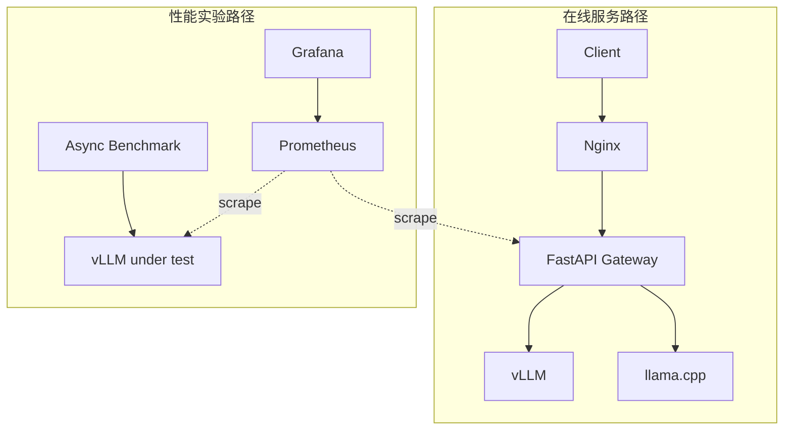
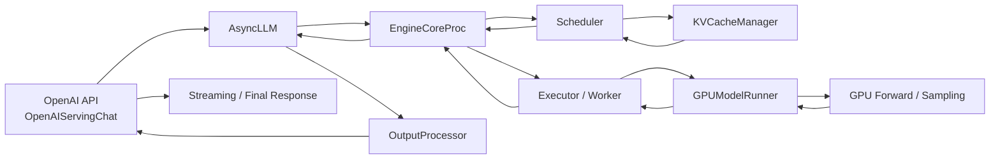
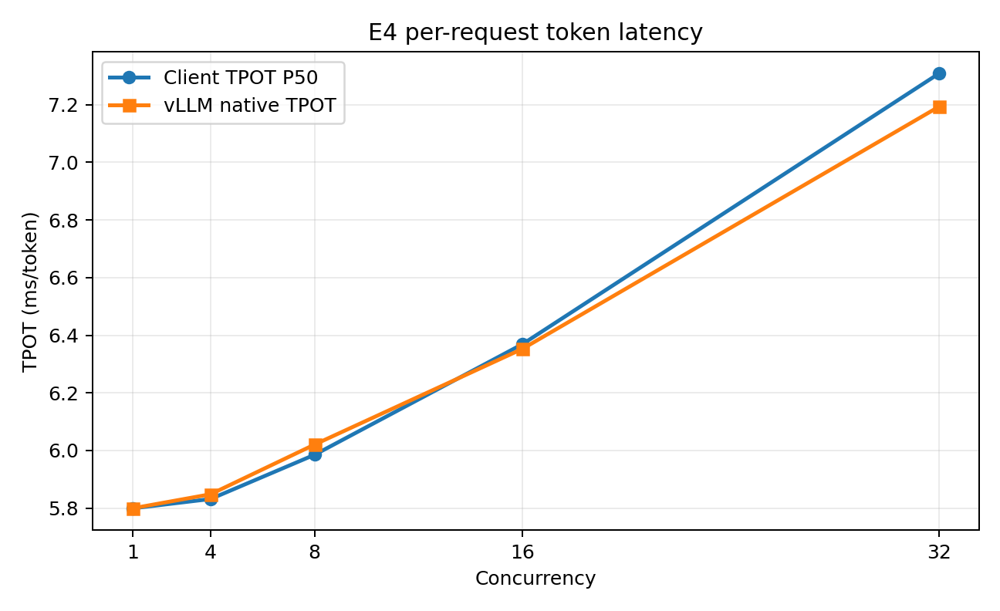

# LLM Serving Performance Lab

面向单机 GPU 的大模型推理服务与性能诊断项目。项目包含两条互补路径：使用 FastAPI Gateway、Nginx、Prometheus 和 Grafana 验证模型服务接入与观测链路；使用直连 vLLM 的 E1–E4 控制变量实验分析 Prefill、Scheduler、KV Cache 与 Decode 压力。

## 核心成果

- 使用 vLLM Native Metrics 对照 TTFT、Queue 与 Prefill 的变化，避免依赖单一端到端延迟判断瓶颈。
- 在相同 c32 workload 下将 `max_num_seqs` 从 32 降至 8，Queue 从约 0.87 s 增至 5.44 s，验证 Scheduler admission capacity 对首 token 延迟的影响。
- 将 `gpu_memory_utilization` 从 0.85 降至 0.35 后，TTFT 均约为 1.49 s 且未发生 Preemption，说明当前 workload 的主导瓶颈不是 KV capacity。
- 在固定 129-token 输入和 512-token 输出的流式实验中，concurrency 1→32 时 TPOT P50 从 5.80 ms 增至 7.31 ms，同时请求窗口输出吞吐显著增长。
- 使用 AutoGPTQ、llm-compressor 与 llama-quantize 完成 Qwen2.5-7B 的 GPTQ-Int4、AWQ W4A16、GGUF Q4_K_M/Q8_0 转换与加载验证，并完成 FP16/AWQ 共 95 组、2850 请求的部署压测。
- 分别验证 Docker Compose 下的 Nginx → Gateway → llama.cpp 链路和 RTX 4090D 上的 Gateway → vLLM 链路，并完成 Prometheus 双 target 抓取与 Grafana 12 个面板查询检查。
- 阅读并整理 vLLM V1 Engine 的请求接入、Scheduler、KV Cache、GPU 执行与输出链路。

## 架构与验证路径



在线服务路径验证模型如何通过统一入口接入业务；性能实验路径用于隔离变量并读取推理引擎原生指标。两条路径共享 vLLM 和可观测性方法，但承担不同的验证目标。

### Gateway 与服务接入

Gateway 提供 OpenAI 风格的 `/v1/chat/completions` 接口、vLLM/llama.cpp 模型名映射、AUTO/固定后端模式、非流式与 SSE 流式转发、HTTP 连接复用、超时与后端异常处理。它为每个请求生成 trace ID 并写入结构化日志，同时暴露请求量、请求延迟、后端选择和错误类型等 Prometheus 指标。

AUTO 模式使用输入字符特征估算 token 数，并以 512-token 阈值演示路由机制，不代表生产环境的最优策略。Gateway 的流式日志记录首个传输块延迟和数据块间隔；真实 token 级 TTFT/TPOT 由 Streaming Benchmark 解析 SSE 正文计算。

E1–E4 默认由 Benchmark 直连 vLLM，以避免 Gateway 转发、连接池和超时设置成为额外实验变量。Gateway 功能通过独立链路验证，不参与 E1–E4 指标归因。

### vLLM 请求处理链路



该图概括 vLLM V1 的请求接入、调度、KV Cache 分配、GPU 执行和输出返回路径。源码阅读对应 vLLM 0.21.0，E1–E4 的运行版本为 0.22.1；完整调用关系和版本范围见 [vLLM V1 系统架构与请求链路](docs/VLLM_SYSTEM_ARCHITECTURE.md)。

## 关键实验结果

项目初期的 E1–E4 运行未主动设置 `max_num_batched_tokens`，vLLM 0.22.1 在当前 Chunked Prefill 配置下采用的有效值为 2048。为避免默认值随版本或环境变化，当前复现脚本显式固定同一数值；公开的 E1–E3 已按该显式值完整重跑，E4 保留相同有效默认值下的历史结果。2048 是复现实验条件，不是单独调优得到的参数，以下结论均限定在该单步 Scheduler token budget 下。

### E2：Prompt Length 与 Prefill

固定 concurrency=4，Prompt 从 137 增至 2054 tokens：

| Prompt tokens | Prefill | Queue | Native TTFT |
|---:|---:|---:|---:|
| 137 | 45.6 ms | 0.02 ms | 57.3 ms |
| 515 | 143.1 ms | 0.02 ms | 173.0 ms |
| 1028 | 260.5 ms | 4.8 ms | 310.6 ms |
| 2054 | 474.6 ms | 61.3 ms | 668.0 ms |

短 Prompt 下 TTFT 增长主要来自 Prefill；Prompt 进一步变长后，Queue 也开始放大 TTFT。2054-token case 超过单步 2048 token budget，因此该点包含 Chunked Prefill 的分段调度影响，不解释为单次 Prefill 的纯计算耗时。

### E3A：Scheduler Capacity

固定 prompt≈1028、max_tokens=256、concurrency=32：

| `max_num_seqs` | Prefill | Queue | Native TTFT |
|---:|---:|---:|---:|
| 32 | 489.4 ms | 873.0 ms | 1492.5 ms |
| 8 | 289.6 ms | 5440.9 ms | 5844.1 ms |

TTFT 的新增部分主要累积在 Queue，而 Prefill 没有同步恶化。该结果支持 Queue-dominated TTFT 的判断。

### E3B：KV Capacity 排除实验

固定 prompt≈1028、max_tokens=256、concurrency=32、`max_num_seqs=32`：

| `gpu_memory_utilization` | Prefill | Queue | Native TTFT |
|---:|---:|---:|---:|
| 0.85 | 489.4 ms | 873.0 ms | 1492.5 ms |
| 0.40 | 489.3 ms | 870.0 ms | 1495.1 ms |
| 0.35 | 489.7 ms | 872.7 ms | 1493.7 ms |

显著压缩 KV budget 后，TTFT 没有出现有意义的变化，且 `preemptions_delta=0`。这个 workload 下的主要限制仍来自调度与 admission pressure。

### E4：Decode 吞吐与延迟

固定 129-token 输入、512-token 输出、Streaming：

| Concurrency | Client TPOT P50 | Native TPOT | 请求窗口输出吞吐 |
|---:|---:|---:|---:|
| 1 | 5.80 ms | 5.80 ms | 170.8 tok/s |
| 4 | 5.83 ms | 5.85 ms | 669.7 tok/s |
| 8 | 5.99 ms | 6.02 ms | 1282.5 tok/s |
| 16 | 6.37 ms | 6.35 ms | 1989.0 tok/s |
| 32 | 7.31 ms | 7.19 ms | 2741.8 tok/s |

这是固定 40 请求批次的 request-window throughput，用于观察并发变化，不代表稳态最大吞吐或系统饱和点。



## 量化模型部署与评测

量化实验覆盖从 FP16 权重到 GPTQ、AWQ 和 GGUF 产物的生成、加载与推理验证。GPTQ/AWQ 使用校准数据完成 W4A16 权重量化；GGUF 先由 Hugging Face 权重转换为 FP16 GGUF，再由 llama-quantize 生成 Q4_K_M 与 Q8_0。

| 产物 | 工具与关键配置 | 结果 |
|---|---|---|
| GPTQ-Int4 | AutoGPTQ，4 bit、group_size=128、desc_act=true、sym=true | 5.21 GB，量化耗时 12.5 min |
| AWQ W4A16 | llm-compressor，W4A16_ASYM、64 条 UltraChat 校准样本、max length=128 | 5.20 GB，量化耗时 1.5 min |
| GGUF Q4_K_M | llama-quantize，4.91 BPW | 4.36 GiB；历史 llama-bench 记录 tg128=77.20±1.51 tok/s |
| GGUF Q8_0 | llama-quantize，8.50 BPW | 7.54 GiB；历史 llama-bench 记录 tg128=45.18±0.41 tok/s |

在 RTX 4090D 上，FP16 矩阵包含 72 组、2160 请求，AWQ-Int4 矩阵包含 23 组、690 请求，均无失败记录。量化矩阵记录非流式 E2E 与 request output rate；TTFT/TPOT 分析采用 E1–E4 的 vLLM Native Metrics 和 Streaming Client。GGUF 部分保留 CUDA 环境下的模型转换、加载与 llama-bench 结果。完整方法和数据见 [量化部署与评测](docs/QUANTIZATION.md)、[量化产物摘要](results/quantization-artifacts.csv)和[量化矩阵摘要](results/quantization-summary.csv)。

## 实验环境边界

| 环境 | 用途 |
|---|---|
| 本地 RTX 5060 | Gateway 与 llama.cpp 开发验证 |
| AutoDL RTX 4090D | vLLM 0.22.1、Qwen2.5-7B-Instruct AWQ Int4、E1–E4 |
| Docker Compose | 展示 Nginx、Gateway、双后端与监控的参考拓扑 |

本地 RTX 5060 不承担 E1–E4 复现。参考 Compose 运行前需要在 `.env` 中调整 `MODEL_DIR`、`VLLM_MODEL_PATH`、`LLAMA_MODEL_PATH`，并根据显存和镜像环境修改 GPU 参数；也可以只启用一个推理后端。

参考编排的宿主机端口可以在 `.env` 中覆盖。若旧环境占用了默认端口，例如可设置 `NGINX_PORT=18080`、`GATEWAY_PORT=18000`、`PROMETHEUS_PORT=19090`、`GRAFANA_PORT=13000` 后再启动。

## 指标口径

- E1–E3 客户端使用非流式请求，只记录 E2E latency 和 request output rate。
- E1–E3 的 TTFT、Queue 和 Prefill 来自 vLLM Prometheus counter 的窗口差分 `Δsum/Δcount`。
- E4 使用 Streaming Client 计算 TTFT/TPOT，并与 vLLM Native TPOT/ITL 交叉验证。
- E4 吞吐使用 benchmark 内部的请求窗口，不使用包含脚本初始化和指标抓取的外层 shell 时间。

## 快速开始

### 性能实验

运行 E4 示例需要 GPU 环境中已安装 vLLM 0.22.1，以及与历史实验一致的权重和 tokenizer；安装与配置边界见复现指南：

```bash
# 先激活已安装 vllm==0.22.1 的 GPU Python 环境
pip install -r requirements/benchmark.txt
export MODEL_PATH=/absolute/path/to/Qwen2.5-7B-Instruct-AWQ-Int4
export TOKENIZER_PATH="$MODEL_PATH"
./scripts/start_vllm.sh e4
```

在另一个终端运行：

```bash
# 激活同一个 GPU Python 环境
export TOKENIZER_PATH=/absolute/path/to/Qwen2.5-7B-Instruct-AWQ-Int4
./scripts/run_e4_decode.sh
```

完整步骤见 [实验复现指南](docs/REPRODUCTION.md)。

### Gateway

```bash
python -m venv .venv
source .venv/bin/activate
pip install -r requirements/gateway.txt
cp .env.example .env
./scripts/start_gateway.sh
```

### 参考 Docker Compose

验证参考 Docker 编排时，先复制并修改 `.env.example`，再按显存条件选择 `vllm` 或 `llama` profile。单后端运行时将 `BACKEND_MODE` 设置成同名后端；双后端均启动时才使用 `auto`。完整命令见 [实验复现指南](docs/REPRODUCTION.md#参考-docker-compose)。

## 文档与数据

- [E1–E4 性能报告](docs/PERFORMANCE_REPORT.md)
- [量化部署与评测说明](docs/QUANTIZATION.md)
- [vLLM V1 系统架构与请求链路](docs/VLLM_SYSTEM_ARCHITECTURE.md)
- [实验复现指南](docs/REPRODUCTION.md)
- [实验限制](docs/LIMITATIONS.md)
- [E1–E3 汇总数据](results/e1-e3-summary.csv)
- [E4 汇总数据](results/e4-summary.csv)
- [量化产物摘要](results/quantization-artifacts.csv)
- [量化矩阵摘要](results/quantization-summary.csv)

仓库采用精简发布结构：`results/` 保存汇总 CSV 与关键图表，`scripts/` 保存实验入口和指标采集流程，技术报告中的数字可直接定位到公开数据与脚本。

## Repository Structure

```text
src/          Gateway、非流式 benchmark、Streaming benchmark、Native Metrics 汇总
scripts/      vLLM/Gateway 启动与 E1–E4 复现入口
deployment/   Docker Compose 参考编排、Dockerfile、Nginx
monitoring/   Prometheus 与 Grafana 配置
results/      精简汇总 CSV 与关键图表
docs/         性能报告、源码架构、复现方法与限制
```
