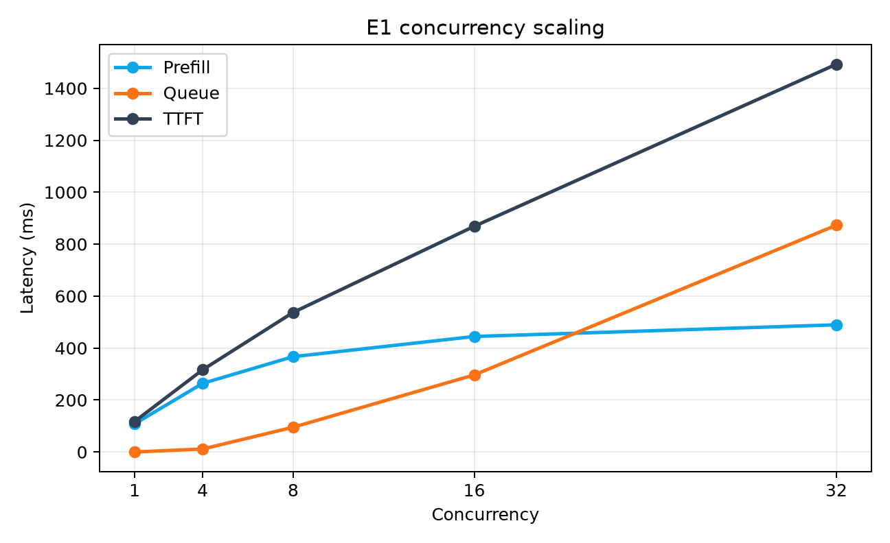
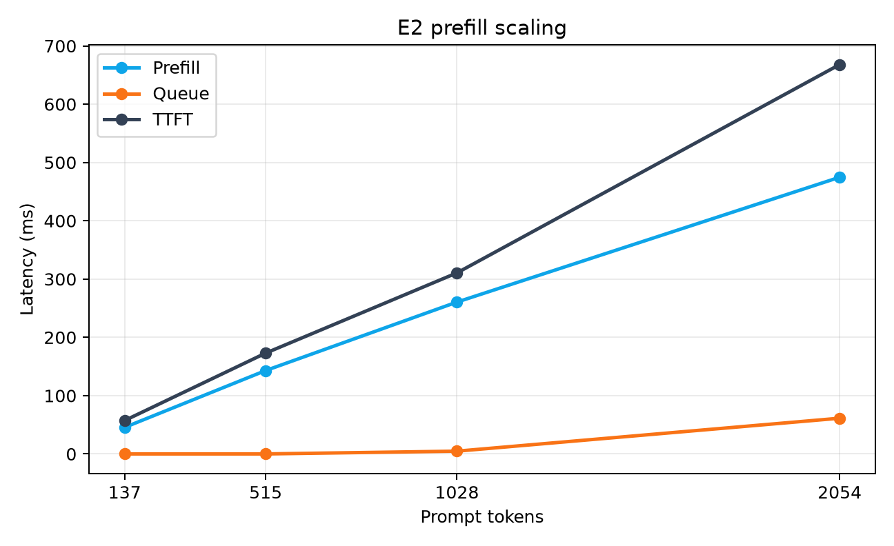
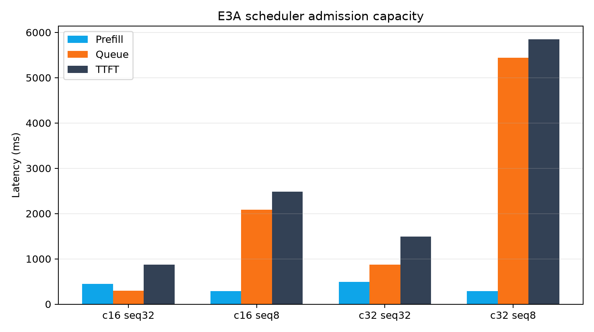
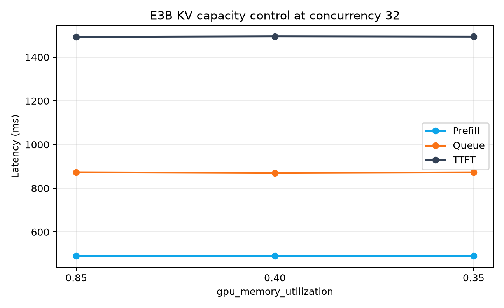
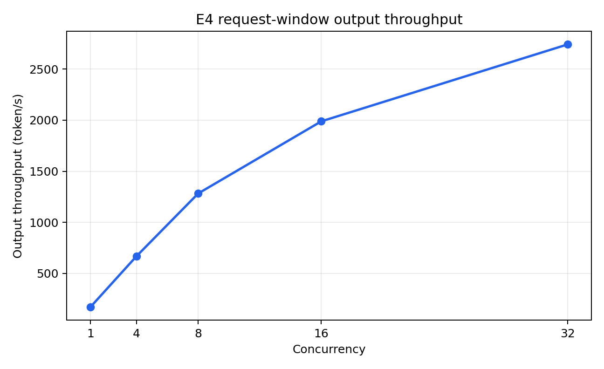

# vLLM Serving Performance Analysis

## 实验目标

E1–E4 使用控制变量方法分析单机 vLLM Serving 中四类问题：并发增加后的 Queue 变化、Prompt Length 对 Prefill 的影响、Scheduler admission capacity 与 KV capacity 的区别，以及 Decode concurrency 下的吞吐—延迟关系。

## 实验环境

```text
GPU: NVIDIA RTX 4090D（AutoDL）
Model: Qwen2.5-7B-Instruct AWQ Int4（历史目录后缀 -lcm）
Runtime quantization: compressed-tensors / Marlin
vLLM: 0.22.1
gpu_memory_utilization: 0.85（E3B 除外）
max_num_seqs: 32（E3A 除外）
Prefix Caching: OFF
Chunked Prefill: ON
max_model_len: 32768
```

关闭 Prefix Caching 是为了让请求的 Prompt Token 实际进入 Prefill。E1–E3 使用非流式请求，客户端 CSV 不提供真实 TTFT；核心指标来自实验窗口前后 vLLM Native Metrics 的差分。

## 数据口径

```text
Native metric average = (after_sum - before_sum) / (after_count - before_count)
```

E1–E3 使用：

- `vllm:time_to_first_token_seconds`
- `vllm:request_queue_time_seconds`
- `vllm:request_prefill_time_seconds`
- `vllm:request_prefill_kv_computed_tokens`
- `vllm:num_preemptions_total`

E4 使用 Streaming Client 记录首个正文事件与后续 token 间隔，并用 Native TPOT 和 ITL 交叉检查。

## E1：Concurrency Scaling

固定 prompt≈1028、max_tokens=256、`max_num_seqs=32`：

| Concurrency | Prefill avg | Queue avg | Native TTFT avg |
|---:|---:|---:|---:|
| 1 | 108.4 ms | 0.02 ms | 117.8 ms |
| 4 | 264.1 ms | 11.4 ms | 316.3 ms |
| 8 | 366.9 ms | 95.3 ms | 537.2 ms |
| 16 | 444.6 ms | 296.5 ms | 868.7 ms |
| 32 | 489.4 ms | 873.0 ms | 1492.5 ms |

E1 表明并发上升同时增加 Prefill workload 与调度等待。它本身不能证明 Queue 全部由 `max_num_seqs` ceiling 导致，因此使用 E3A 进一步验证。



## E2：Prefill Scaling

固定 concurrency=4，仅改变 Prompt Length：

| Prompt tokens | Prefill KV | Prefill avg | Queue avg | Native TTFT avg |
|---:|---:|---:|---:|---:|
| 137 | 137 | 45.6 ms | 0.02 ms | 57.3 ms |
| 515 | 515 | 143.1 ms | 0.02 ms | 173.0 ms |
| 1028 | 1028 | 260.5 ms | 4.8 ms | 310.6 ms |
| 2054 | 2054 | 474.6 ms | 61.3 ms | 668.0 ms |

短 Prompt 阶段，TTFT 的增加主要来自 Prefill。Prompt 进一步变长后，请求占用执行资源更久，Queue 也开始增加，形成次生放大。



## E3A：Scheduler Admission Capacity

保持模型、workload、KV budget、Prefix Caching 与 Chunked Prefill 配置一致，将 `max_num_seqs` 从 32 降至 8。

| Concurrency | `max_num_seqs` | Prefill avg | Queue avg | Native TTFT avg |
|---:|---:|---:|---:|---:|
| 16 | 32 | 445 ms | 297 ms | 869 ms |
| 16 | 8 | 290 ms | 2084 ms | 2482 ms |
| 32 | 32 | 489 ms | 873 ms | 1493 ms |
| 32 | 8 | 290 ms | 5441 ms | 5844 ms |

当请求压力超过当前 admission capacity 后，新增延迟主要进入 Queue。Prefill 没有同步恶化，因此不能把 TTFT 上升解释为 Prefill compute 变慢。



## E3B：KV Capacity Control

固定 prompt≈1028、max_tokens=256、concurrency=32 和 `max_num_seqs=32`：

| `gpu_memory_utilization` | Prefill avg | Queue avg | Native TTFT avg |
|---:|---:|---:|---:|
| 0.85 | 489.4 ms | 873.0 ms | 1492.5 ms |
| 0.40 | 489.3 ms | 870.0 ms | 1495.1 ms |
| 0.35 | 489.7 ms | 872.7 ms | 1493.7 ms |

虽然单独的容量验证运行观察到约 85%–90% KV Usage，但所有列入汇总的实验均为 `preemptions_delta=0`。显著削减 KV budget 也没有明显改变 TTFT。KV Usage 表示压力，不能单独证明 KV exhaustion。



## E4：Decode Scaling

固定 129-token Prompt、512-token 实际输出、`temperature=0`、`ignore_eos=true`，仅改变 concurrency：

| Concurrency | Client TTFT P50 | Client TPOT P50 | Native TPOT | Queue avg | Request-window TPS |
|---:|---:|---:|---:|---:|---:|
| 1 | 33.37 ms | 5.80 ms | 5.80 ms | 0.02 ms | 170.8 |
| 4 | 72.18 ms | 5.83 ms | 5.85 ms | 0.02 ms | 669.7 |
| 8 | 119.66 ms | 5.99 ms | 6.02 ms | 0.02 ms | 1282.5 |
| 16 | 260.56 ms | 6.37 ms | 6.35 ms | 0.05 ms | 1989.0 |
| 32 | 351.34 ms | 7.31 ms | 7.19 ms | 4.69 ms | 2741.8 |

TPOT 随并发升高而恶化，但系统在同一时间处理更多 Decode sequences，因此输出吞吐继续增长。Client 与 Native TPOT 变化方向和数值接近。

请求窗口从 benchmark 开始等待请求到全部请求完成。外层实验时间还包含脚本初始化、指标抓取与收尾，不作为主吞吐分母。




## 诊断结论

```text
TTFT 上升
├── Prefill 与 Prompt KV 同步上升，Queue 低：检查 Prefill compute
├── Queue 上升，Prefill 未同步恶化：检查 Scheduler/admission
└── KV Usage 上升且伴随 Preemption/分配失败：检查 KV capacity

TPOT 上升
└── 结合 output throughput 判断 Decode batching 的吞吐—延迟权衡
```

单个指标不足以直接定位瓶颈。Waiting 可能由 sequence capacity、token budget、KV block、调度策略或执行能力共同引起；高 KV Usage 也不等于 KV exhaustion。

## 结果文件

- [E1–E3 summary](../results/e1-e3-summary.csv)
- [E4 summary](../results/e4-summary.csv)
- [复现步骤](REPRODUCTION.md)
- [限制](LIMITATIONS.md)

## 数据与脚本映射

| 实验 | 公开数据 | 关键字段 | 运行脚本 |
|---|---|---|---|
| E1 Concurrency | `e1-e3-summary.csv` / `e1-c1,c4,c8,c16,c32` | concurrency、Prefill、Queue、Native TTFT | `run_e1_concurrency.sh` |
| E2 Prompt Length | `e1-e3-summary.csv` / `e2-p128,p512,p1024,p2048` | prompt_tokens_mean、Prefill、Queue、Native TTFT | `run_e2_prefill.sh` |
| E3A Scheduler | `e1-e3-summary.csv` / `e1-*`、`e3a-seq8-*` | max_num_seqs、Prefill、Queue、Native TTFT | `run_e1_concurrency.sh`、`run_e3a_scheduler.sh` |
| E3B KV Capacity | `e1-c32`、`e3b-mem040-*`、`e3b-mem035-*` | gpu_memory_utilization、Preemption、Prefill、Queue、Native TTFT | `run_e3b_kv_capacity.sh` |
| E4 Decode | `e4-summary.csv` | Client/Native TTFT、TPOT、request window、output throughput | `run_e4_decode.sh` |

CSV 位于 [`results/`](../results/)，脚本位于 [`scripts/`](../scripts/)。时间字段统一使用毫秒；README 中以秒展示的 Queue 数值由毫秒除以 1000 并按显示精度取舍。
