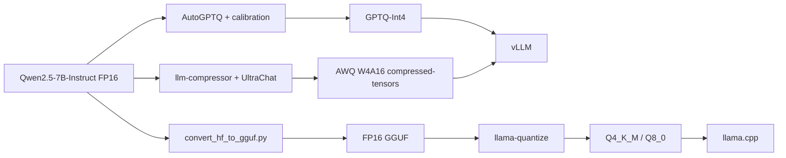

# 量化模型转换、部署与评测

本实验围绕 Qwen2.5-7B-Instruct 验证三条权重量化与部署路径：AutoGPTQ GPTQ-Int4、llm-compressor AWQ W4A16，以及 llama.cpp GGUF Q4_K_M/Q8_0。内容包括量化产物生成、引擎加载、显存行为观察和受控压测。

## 技术路径



GPTQ 和 AWQ 是基于校准数据的训练后权重量化方法。GPTQ 按层近似最小化量化造成的输出重建误差，并在量化过程中补偿误差；AWQ 根据激活统计搜索缩放因子，降低显著通道的量化误差。GGUF 是模型文件格式，Q4_K_M 和 Q8_0 才是本实验采用的 llama.cpp 量化类型。

## 量化配置

| 产物 | 工具 | 关键参数 | 校准数据 | 运行环境 |
|---|---|---|---|---|
| GPTQ-Int4 | AutoGPTQ | bits=4、group_size=128、desc_act=true、sym=true、damp_percent=0.01 | 128 条由短双语模板重复生成的样本，截断上限 2048 | RTX 4090D 24 GB |
| AWQ W4A16 | llm-compressor 0.11.0 | W4A16_ASYM、targets=Linear、ignore=lm_head、duo_scaling=both | UltraChat 64 条，seed=42、截断上限 128 | RTX 4090D 24 GB |
| GGUF Q4_K_M | llama-quantize | 4.91 BPW，部分张量保留 q6_K/f32 | 不需要校准集 | 历史本地 CUDA 运行 |
| GGUF Q8_0 | llama-quantize | 8.50 BPW，归一化张量保留 f32 | 不需要校准集 | 历史本地 CUDA 运行 |

GPTQ 使用 128 条短双语模板样本完成校准；AWQ 使用 64 条 UltraChat 样本，并将截断上限设为 128，以适配租用环境的显存和运行时间。两条链路均完成量化、产物保存和加载验证；模型质量评测范围见 [实验限制](LIMITATIONS.md)。

参数化参考脚本：

- [`scripts/quantization/quantize_gptq.py`](../scripts/quantization/quantize_gptq.py)
- [`scripts/quantization/quantize_awq.py`](../scripts/quantization/quantize_awq.py)
- [`scripts/quantization/quantize_gguf.sh`](../scripts/quantization/quantize_gguf.sh)

这些脚本由历史运行命令清理而来，去除了个人绝对路径。AutoGPTQ 与 llm-compressor 对 PyTorch、Transformers、CUDA 和扩展版本较敏感，运行前需要按目标 GPU 环境建立独立虚拟环境。

## 运行入口

```bash
# GPTQ-Int4
python scripts/quantization/quantize_gptq.py \
  --model Qwen/Qwen2.5-7B-Instruct \
  --output /path/to/Qwen2.5-7B-Instruct-GPTQ-Int4

# AWQ W4A16 compressed-tensors
python scripts/quantization/quantize_awq.py \
  --model Qwen/Qwen2.5-7B-Instruct \
  --output /path/to/Qwen2.5-7B-Instruct-AWQ-Int4

# GGUF；Q4_K_M 也可以替换为 Q8_0
scripts/quantization/quantize_gguf.sh \
  /path/to/llama.cpp \
  /path/to/Qwen2.5-7B-Instruct \
  /path/to/output \
  Q4_K_M
```

GPTQ/AWQ 脚本在产物目录写入 `experiment-metadata.json`，记录源模型、量化参数、校准规模和实际运行时间，便于后续复跑时区分不同配置。

## 运行问题记录

- AutoGPTQ 的校准样本需要按版本提供字典结构。历史运行先后遇到一维 tensor 索引错误和缺少 `attention_mask`；最终为每个样本同时传入 `input_ids` 与 `attention_mask`。
- 历史 GPTQ 环境的组件版本见下表。Optimum 与 AutoGPTQ 的加载接口不兼容，验证阶段直接使用 `AutoGPTQForCausalLM.from_quantized()`。
- AWQ 使用 llm-compressor 0.11.0。租用容器的系统盘空间不足时，将 Conda 环境、pip cache 和临时目录迁移到数据盘；模型下载使用 `snapshot_download()` 的断点续传与完整性校验，避免不完整权重进入量化流程。

这些问题属于历史环境记录。当前脚本只保留量化逻辑，不自动安装或覆盖 PyTorch/CUDA 依赖。

| GPTQ 环境组件 | 历史记录 |
|---|---|
| PyTorch | 2.1.2+cu121 |
| Transformers | 4.45.2 |
| PEFT | 0.13.2 |
| AutoGPTQ | 0.8.0.dev0，源码构建 CUDA 扩展 |
| Optimum | 2.1.0；与上述 AutoGPTQ 加载接口不兼容 |

## 量化产物

| 产物 | 大小 | 相对约 15 GB FP16 | 量化耗时 | 加载验证 |
|---|---:|---:|---:|---|
| GPTQ-Int4 | 5.21 GB | 约 2.9× 压缩 | 12.5 min | AutoGPTQ 推理成功 |
| AWQ W4A16 | 5.20 GB | 约 2.9× 压缩 | 1.5 min | 完成生成 smoke test 与 compressed-tensors 保存；生成时出现 attention-mask 警告 |
| GGUF Q4_K_M | 4.36 GiB | 4.91 BPW | 49.05 s | llama-cli / llama-bench 成功 |
| GGUF Q8_0 | 7.54 GiB | 8.50 BPW | 19.95 s | llama-cli / llama-bench 成功 |

结构化记录见 [`results/quantization-artifacts.csv`](../results/quantization-artifacts.csv)。表格保留历史命令输出使用的 GB/GiB 单位，压缩比按约 15 GB FP16 基线保留一位有效小数。

## 历史 llama.cpp 基准记录

历史 `llama-bench` 环境与命令记录如下：

| 项目 | 记录值 |
|---|---|
| llama.cpp commit | `fde69a360` |
| build number | `9120` |
| Backend | CUDA |
| GPU | NVIDIA GeForce RTX 5060 |
| 程序报告 VRAM | 8150 MiB |
| `-ngl` 请求值 | 99 |

| 量化类型 | pp512 | tg128 |
|---|---:|---:|
| Q4_K_M | 2935.88 ± 58.94 tok/s | 77.20 ± 1.51 tok/s |
| Q8_0 | 1768.68 ± 47.62 tok/s | 45.18 ± 0.41 tok/s |

`-ngl 99` 配置 llama.cpp 尽可能将模型层卸载到 GPU，运行输出确认 CUDA backend 生效，汇总结果中的 `ngl` 列为 99。在该环境下，Q4_K_M 的模型体积更小，prompt processing 与 token generation 均高于 Q8_0。适用范围见 [实验限制](LIMITATIONS.md)。

## vLLM 并发矩阵

| 权重 | 输入长度 | 输出上限 | 并发 | 组数 | 请求数 | 成功数 |
|---|---|---|---|---:|---:|---:|
| FP16 | 128/512/1024 | 64/128/256/512 | 1/2/4/8/16/32 | 72 | 2160 | 2160 |
| AWQ-Int4 | 核心矩阵：128/1024；专项：1024 | 核心矩阵：128/512；专项：256 | 核心矩阵：1/4/16/30；专项：1/2/4/8/16/24/32 | 23 | 690 | 690 |

服务配置为 vLLM 0.22.1、`gpu_memory_utilization=0.9`、`max_num_seqs=128`、`max_model_len=4096`。矩阵规模摘要见 [`results/quantization-summary.csv`](../results/quantization-summary.csv)。完整逐请求 CSV 与 GPU 采样日志保留在历史档案中。

## 显存观察

vLLM 的 `gpu_memory_utilization` 控制执行器可使用的显存预算，其中包含权重、KV Cache 和运行时工作区。使用 0.9 时，FP16、GPTQ 和 AWQ 进程都可能接近相似的总显存占用，因为量化节省的空间会被用于 KV Cache 预算。总显存接近不表示 INT4 权重被还原并长期以 FP16 保存；判断加载路径应结合模型配置和 vLLM 日志中的 quantization、compressed-tensors、Marlin 等信息。

## 测量口径

早期 vLLM 对比脚本使用非流式 `LLM.generate()` 或非流式 HTTP 请求，在完整输出返回后计算：

```text
request_time_per_output_token = e2e_latency / output_tokens
```

该值包含 Prefill、调度和 Decode，当前文档将其归类为 request time per output token。量化矩阵保留非流式 E2E、request output rate、运行成功率和 workload 覆盖；TTFT/TPOT 使用 E1–E4 的 Streaming Client 与 vLLM Native Metrics。

FP16/AWQ 性能对比固定输入长度、输出上限、并发、采样参数和服务配置，复跑入口复用仓库中的 benchmark 与 Native Metrics 采集流程。

## 工程产出

- 实现 GPTQ、AWQ、GGUF 三条参数化量化流程，覆盖校准数据构造、量化配置、产物保存和运行元数据记录。
- 排查 AutoGPTQ 校准输入格式、CUDA 扩展和 Optimum 加载接口兼容问题，完成 GPTQ 模型加载与生成验证。
- 使用 llm-compressor 完成 AWQ W4A16_ASYM 量化，并以 compressed-tensors 格式接入 vLLM/Marlin 执行路径。
- 使用 llama.cpp 完成 FP16 GGUF 转换、Q4_K_M/Q8_0 量化、CUDA 加载和 llama-bench 测试。
- 构建 FP16/AWQ 共 95 组、2850 请求的并发矩阵，并将早期非流式指标重新归类为 E2E 与 request output rate。
- 分析 vLLM 显存预算对权重、KV Cache 和工作区的共同影响，避免用进程总显存直接判断量化加载状态。

完整实验约束集中记录在 [实验限制](LIMITATIONS.md)。
