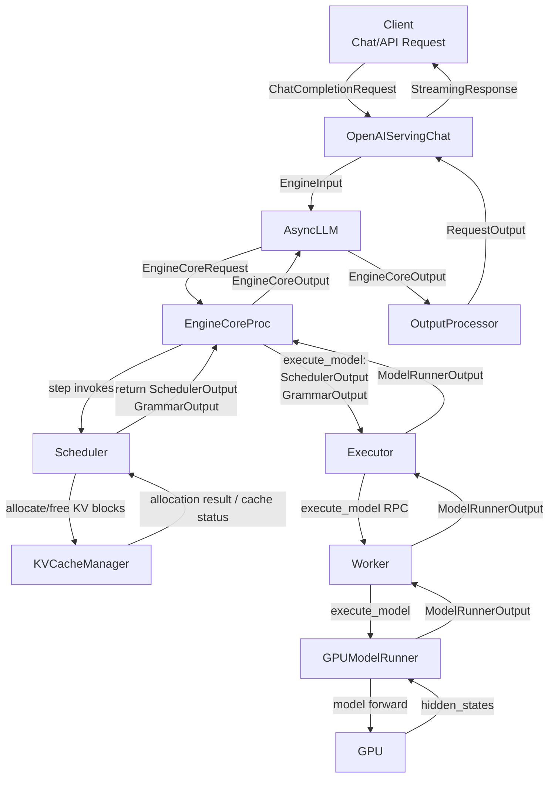
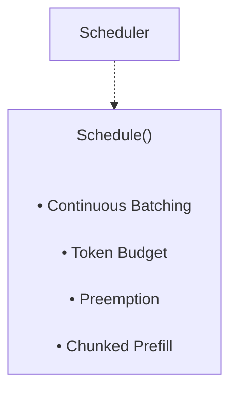
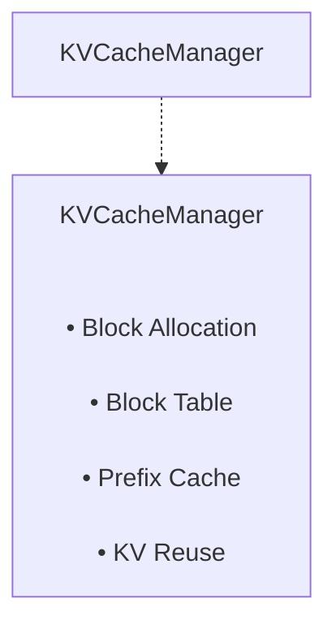
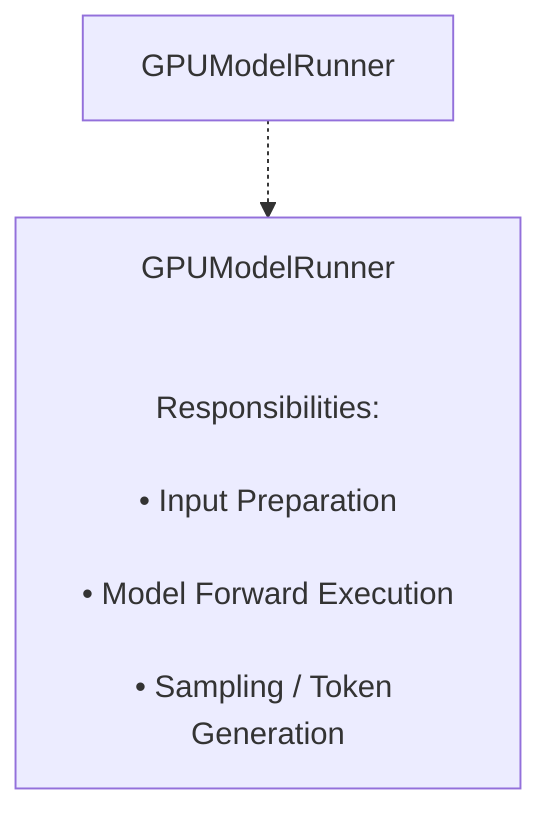

# vLLM V1 System Architecture

```text
源码阅读版本：vLLM 0.21.0
性能实验版本：vLLM 0.22.1（本文未逐函数重新核对该版本）
Engine：V1
执行路径：UniprocExecutor
范围：请求接入、Scheduler、KV Cache、GPU 执行和输出
```

本文沿单进程执行路径整理主要调用关系。多进程 Executor、分布式并行与投机解码只在调用链涉及处标注，不作为本文重点。

## 0. 母图

源码版本0.21.0












## 1. 接受请求

```
vllm/entrypoints/openai/chat_completion/api_router.py
vllm/entrypoints/openai/chat_completion/serving.py
vllm/v1/engine/async_llm.py
```

## 1.1 接收函数

```
async def create_chat_completion(request: ChatCompletionRequest, raw_request: Request)
```

接受函数处理流程：

```
create_chat_completion()
    OpenAIServingChat.create_chat_completion() // 封装并处理请求
        OpenAIServingChat._create_chat_completion()
            OpenAIServingChat.render_chat_request() // 预处理请求
                OpenAIServingRender.render_chat(0 // 将prompt转化为token
            AsyncLLM(EngineClient).generate() // 客户端处理请求
```

## 2.客户端处理请求

```
vllm/v1/engine/async_llm.py

AsyncLLM(EngineClient).generate() // 客户端处理请求
```

### 2.1 处理请求流程

```
AsyncLLM.generate() // 客户端处理请求的函数
	AsyncLLM.add_request()
        AsyncLLM._add_request()
            OutputProcessor.add_request() // 保存request基础信息，为后续完成请求快速返回结果做准备
            AsyncMPClient.add_request_async() // 异步添加请求到服务器端
                AsyncMPClient._send_input(EngineCoreRequestType.ADD, request) // 发送请求给服务器端 EngineCoreProc
```

### 2.2 结果返回

#### 客户端接收服务器结果

```
AsyncMPClient._ensure_output_queue_task()
	process_outputs_socket() // 异步数据接受函数
		将结果存入 outputs_queue // 此处暂存请求结果

AsyncLLM._run_output_handler()
	output_handler() // 异步数据获取函数
		AsyncMPClient.get_output_async() // 获取 outputs_queue 请求结果队列
			OutputProcessor.process_outputs() // 处理请求结果
				RequestState.make_request_output() // 根据EngineCoreOutput生成RequestOutput
				req_state.queue.put(request_output) // 这里把RequestOutput存入RequestOutputCollector
			OutputProcessor.update_scheduler_stats() // 更新请求状态
```

#### 返回结果给用户

```
create_chat_completion() // FastAPI路由接收 HTTP POST /v1/chat/completions 请求
    OpenAIServingChat.create_chat_completion() // 封装并处理请求
        OpenAIServingChat._create_chat_completion()
            AsyncLLM(EngineClient).generate() // 客户端处理请求
                AsyncLLM.add_request() // 添加请求并返回结果的收集器 q:RequestOutputCollector
                q.get_nowait() or await q.get() // 根据收集器循环获取结果 RequestOutput
                yield out // 返回结果
            OpenAIServingChat.chat_completion_stream_generator() // 流式结果处理
                遍历 AsyncIterator[RequestOutput] 获取 RequestOutput
                遍历 RequestOutput.outputs, 生成增量数据，并yield
            yield chat_completion_stream_generator() 的结果
        处理并yield _create_chat_completion() 的结果
    将结果以json格式通过网络发送给用户
```

## 3.服务器处理请求

```
vllm/v1/engine/core.py  // EngineCoreProc
vllm/v1/core/sched/scheduler.py // Scheduler(SchedulerInterface)
vllm/v1/executor/uniproc_executor.py  // 单进程执行器，本文档以此为准
vllm/v1/executor/multiproc_executor.py  //多进程执行器
vllm/v1/worker/gpu_worker.py // Worker执行者
```

### 3.1接受请求

```
EngineCoreProc.process_input_sockets() // 接受网络请求
	EngineCoreProc.preprocess_add_request()
	input_queue.put_nowait() // 将请求加入input队列
```

### 3.2 处理请求

```
EngineCoreProc.run_busy_loop()  // 内部循环周期性调用两个函数
	EngineCoreProc._process_input_queue() // 处理请求输入
	EngineCoreProc._process_engine_step() // 调用步进函数
```

#### 3.2.1 EngineCoreProc._process_input_queue()

```
EngineCoreProc._process_input_queue()
	EngineCoreProc._handle_client_request() // 处理请求
		EngineCoreProc.add_request()
			Scheduler.add_request() // 把请求交给调度器Scheduler统一管理、排队、调度给推理引擎执行
				全新请求：第一次收到request_id，加入等待队列管理
				旧请求：重复 request_id，流式增量分片（续包）
```

#### 3.2.2 EngineCoreProc._process_engine_step()

```
EngineCoreProc._process_engine_step()
	step_fn() //lambda函数， 内部调用 EngineCoreProc.step()
		EngineCoreProc.step() // 主循环函数
	将step输出结果存入output_queue
	EngineCoreProc.post_step() // 推理结束后的后置处理
		使用同步调度+开启投机解码功能+开启模型前向计算时，投机解码产出的草稿 token 同步更新到调度器 Scheduler

同步调度：主线程串行控制推理 step，模型执行完立刻在主线程拿到 draft token，直接同步更新给 scheduler；
异步调度：模型推理下沉到独立 worker 进程 / 协程异步执行，主线程无法提前、同步获取 draft token； 因此获取 + 更新 draft token 的逻辑被迁移到 worker 内部，主线程的 post_step 不需要再处理。
```

#### 3.2.3 EngineCoreProc.step()

```
EngineCoreProc.step() // Schedule, execute, and make output.
	Scheduler.schedule() // 规划本次步进要处理的request，并为其分配block，输出 SchedulerOutput
	UniProcExecutor.execute_model() // 调度模型进行前向计算，本文档以单进程为例讲解
	Scheduler.get_grammar_bitmask() // 获取 grammar 约束掩码，根据语法规则生成 token 采样掩码，约束只能输出合法 token
	UniProcExecutor.sample_tokens() // 特殊模式下模型只跑 forward，不做采样，这里需要专门调用采样
	EngineCoreProc._process_aborts_queue() // 处理提前终止的请求，update_from_output 之前处理 abort，防止已经 abort 的请求还生成输出返回给上层。
	Scheduler.update_from_output() // 更新状态，生成对外输出
```

Scheduler.schedule()

```
1.优先调度正在运行的请求（decode / chunked‑prefill，循环遍历running队列
	a.计算请求剩余需要计算的token数
	b.为请求本轮计算的token分配block
	c.如果block资源不足，从running队列中选择请求抢占其资源
	d.分配资源结束，将请求加入scheduled_running_reqs队列中
	e.收集、截断、打包上一轮的投机 token，等待后续交给 model‑runner 执行验证
	f.继续 running 循环(a-e)
2.调度 waiting 队列等待的新请求(本轮没有发生抢占且引擎没有pause时加入新请求)
	a.根据调度策略挑选请求队列，并取出顶部的请求
	b.如果是被block的请求，那么尝试提升为可调度，不能提升就移入step_skipped_waiting
	c.检查Lora 并发约束
	d.进行Prefix‑Cache 本地 + 远端 KV 匹配，计算出已经计算过的token总数
	e.计算请求本轮需要调度多少 token(此处即为chunked‑prefill调度层分片控制逻辑)
	f.调用KVCacheManager为request分配 KV Cache 块
	g.请求加入running队列
	h.继续 waiting 循环(a-g)
3.组装所有分配数据到 SchedulerOutput，并返回给上层EngineCore.step()
```

UniProcExecutor.execute_model()

```
UniProcExecutor.execute_model()
	UniProcExecutor.collective_rpc() // 调用Worker的函数
		Worker.execute_model() // 真正执行模型推理的进程
			GPUModelRunner.execute_model() // 把调度输出交给 ModelRunner，执行 GPU 前向推理
```

UniProcExecutor.sample_tokens()

```
UniProcExecutor.sample_tokens()
	UniProcExecutor.collective_rpc() // 调用Worker的函数
		Worker.sample_tokens() // 真正执行采样的进程
			GPUModelRunner.sample_tokens() // 把调度输出交给 ModelRunner，执行采样
```

Scheduler.update_from_output()

```
a.遍历前向推理计算完的所有请求
b.推测解码（Speculative Decoding）统计与状态修正
c.更新请求状态与停止检查
d.结构化输出（Grammar）校验(此处为二次校验，第一次是在UniProcExecutor.sample_tokens(),GPU 侧采样阶段，前置拦截)
e.处理停止请求(判断停止原因分情况处理，包含已完成，终止，被抢占的状态)
d.组装EngineCoreOutput并添加到outputs输出队列
```

### 3.3 下发结果

```
EngineCoreProc.process_output_sockets()
	a.从self.output_queue队列中获取request的结果
	b.序列化输出对象到buffer
	c.零拷贝发送给对应客户端socket
```

## 名词解释

### LoRA（Low‑Rank Adaptation，大模型微调技术）

大底座模型（比如 Qwen、Llama）本身参数巨大，几十亿上百亿权重。使用LoRA训练快、占显存小；LoRA 文件很小，可以保存很多个不同任务的适配器；推理时可以随时切换不同 LoRA，不需要重新加载整个大模型。

- 传统量微调：把整个大模型所有权重全部改动，需要巨大显存，训练成本极高。
- **LoRA：不去改动原始大模型权重，冻结底座，只训练两套很小的矩阵 A、B（低秩矩阵）。**

推理时输出计算公式：(Y = WX + BA X\)

- W：原始大模型权重，永远不动，常驻 GPU
- \(A、B\)：LoRA 小矩阵，**适配器（adapter）**，这就是 LoRA 权重文件，体积很小，几十 MB 级别。
